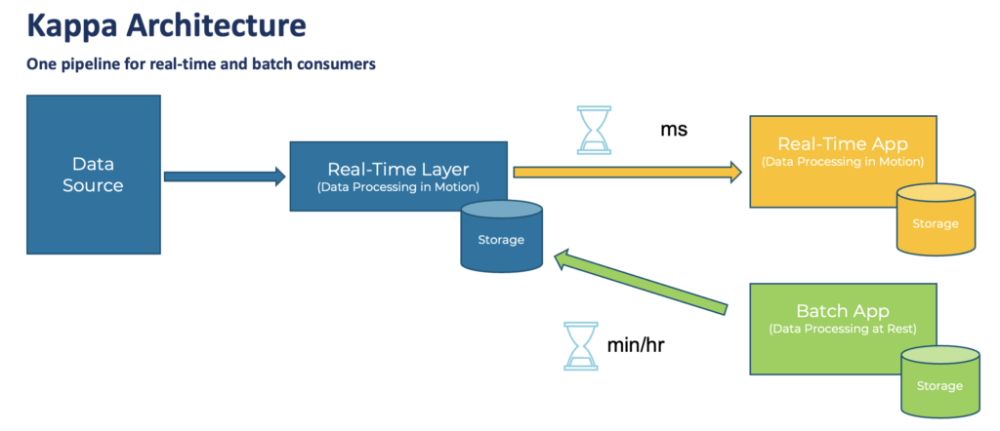

# Github Public Event Streaming

## Goal
Goal of this project is to create a Realtime Dashboard in Google Data Studio which shows current trends on Github in the areas of Data Engineering and Data Science

## Mission Statement
The database should allow Data Scientists and Data Engineers to see current adoption and participation trends in open source projects

## Mission Objective
- The database keeps track of user's general interest in repositories using the Watch event
- The database keeps track of user's adoption of repositories in their projects (using Stars)
- The database keeps track of user's participation in open source projects (using Forks/Issues/PR Reviews)
- The database keeps track of recent releases of an open source package
- The database keeps track of member of an organization 

## Architecture
The Kappa Architecture is used in this project

## Technologies
- Google Pub/Sub for async processing of Github Stream using Publisher/Subscriber model
- Google Bigquery to persist the most relevant data for long term analysis
- Google Data Studio to visualize the data stream (either using Google BigQuery or Google Pub/Sub)

## Github Events

*Sourced from https://ghapi.fast.ai/event.html*

Each event will serve as separate topic in the context of a Pub/Sub model

Out of scope: This project not processing the following Events Types 
- `Delete`
- `Public`

<table class="table table-sm table-striped small">
<colgroup>
<col style="width: 50%">
<col style="width: 50%">
</colgroup>
<thead>
<tr class="header">
<th style="text-align: left;">Type</th>
<th style="text-align: left;">Description</th>
</tr>
</thead>
<tbody>
<tr class="odd">
<td style="text-align: left;">Push</td>
<td style="text-align: left;">⭐ <strong>fedya</strong> pushed 1 commits to “rolling” in <em>OpenMandrivaAssociation/g…</em></td>
</tr>
<tr class="even">
<td style="text-align: left;">Delete</td>
<td style="text-align: left;">✂ <strong>dependabot[bot]</strong> deleted branch “packit-0.5.0” in <em>paketo-buildpacks/occam</em></td>
</tr>
<tr class="odd">
<td style="text-align: left;">Create</td>
<td style="text-align: left;">🏭 <strong>github-classroom[bot]</strong> created repository in <em>Introduction-to-Programming-OSOWSKI/…</em>: “1-5-add-two-numbers-noraahlman23 created by GitHu…”</td>
</tr>
<tr class="even">
<td style="text-align: left;">PR</td>
<td style="text-align: left;">📬 <strong>JerryMacedoCastro</strong> opened PR #1 on <em>JerryMacedoCastro/tb-arquitetura-js</em>: “Input component created”</td>
</tr>
<tr class="odd">
<td style="text-align: left;">Member</td>
<td style="text-align: left;">💃 <strong>github-classroom[bot]</strong> added member noraahlman23 in <em>Introduction-to-Programming-O…</em></td>
</tr>
<tr class="even">
<td style="text-align: left;">Public</td>
<td style="text-align: left;">♥ <strong>navikt</strong> made public repo <em>navikt/syfoinntektsmelding</em></td>
</tr>
<tr class="odd">
<td style="text-align: left;">PR Review Comment</td>
<td style="text-align: left;">🗨 <strong>fruttasecca</strong> created review comment on PR #97 in <em>orchest/orchest</em>: “Does this make it so that users coming from an ol…”</td>
</tr>
<tr class="even">
<td style="text-align: left;">Fork</td>
<td style="text-align: left;">🍽 <strong>amin-lotf</strong> forked <em>vinaygaba/Learn-Jetpack-Compose-By-Example</em>: “🚀 This project contains various examples that sho…”</td>
</tr>
<tr class="odd">
<td style="text-align: left;">Commit Comment</td>
<td style="text-align: left;">🎉 <strong>vercel[bot]</strong> created commint comment in <em>Samaraferreira/test-frontend</em>: “Successfully deployed to the following URLs: * […”</td>
</tr>
<tr class="even">
<td style="text-align: left;">Watch</td>
<td style="text-align: left;">👀 <strong>ikarius</strong> started watching <em>jorgebucaran/awsm.fish</em></td>
</tr>
<tr class="odd">
<td style="text-align: left;">PR Review</td>
<td style="text-align: left;">💌 <strong>fruttasecca</strong> created PR review in <em>orchest/orchest</em></td>
</tr>
<tr class="even">
<td style="text-align: left;">Release</td>
<td style="text-align: left;">🚀 <strong>github-actions[bot]</strong> published release v1.1.3 in <em>vouv/srun</em></td>
</tr>
<tr class="odd">
<td style="text-align: left;">Issues</td>
<td style="text-align: left;">🐛 <strong>efritz</strong> opened issue #16915 on <em>sourcegraph/sourcegraph</em>: “auto-indexing: Add docker/src-cli command wall cl…”</td>
</tr>
<tr class="even">
<td style="text-align: left;">Gollum</td>
<td style="text-align: left;">📚 <strong>TradingToolCrypto</strong> created wiki page in <em>TradingToolCrypto/TradingTool-Wiki</em></td>
</tr>
<tr class="odd">
<td style="text-align: left;">Issue Comment</td>
<td style="text-align: left;">💬 <strong>jerhard</strong> created comment on issue #2570 in <em>ls1intum/Artemis</em>: “Do you think that spaces (or even white space cha…”</td>
</tr>
</tbody>
</table>